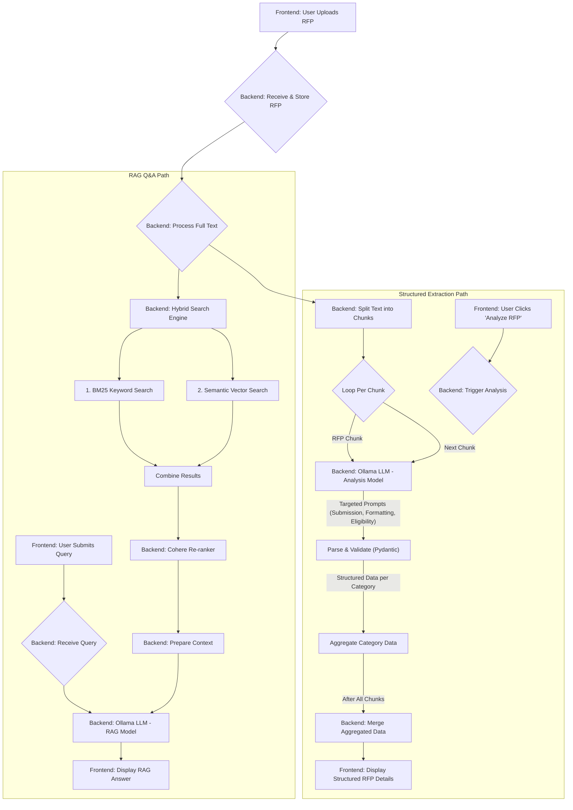

# AI-Powered RFP Analysis & Q&A System

## Project Overview

This project implements a sophisticated system for analyzing Request for Proposal (RFP) documents. It leverages Retrieval Augmented Generation (RAG) to allow users to upload RFP files (PDFs, text) and ask natural language questions about their content. The system retrieves relevant sections from the document and uses a Large Language Model (LLM) to generate concise, context-aware answers. This core Q&A functionality is designed to help users quickly understand complex RFP requirements and find specific information efficiently.

Beyond general Q&A, the system features a dedicated module for structured data extraction from RFPs. This module uses an LLM, guided by Pydantic schemas, to identify and pull out key pieces of information such as submission deadlines, formatting requirements (page limits, font specifications), and crucial eligibility criteria. This extracted data is presented in a clear, organized format on the frontend, providing users with an immediate overview of critical RFP parameters, complementing the more free-form RAG interaction.

## Workflow Overview

The application follows a dual-path workflow for document interaction: RAG-based Q&A and Structured Data Extraction.



## Hybrid Search & Re-ranking RAG Approach

To ensure accurate and relevant information retrieval for the Q&A module, this project employs a sophisticated hybrid search strategy combined with a re-ranking step. When a user poses a question, the system first splits the uploaded RFP document into manageable text chunks. These chunks are then indexed using two distinct retrieval methods:

1.  **BM25 Retriever:** This is a keyword-based sparse retriever that excels at finding documents containing the exact terms present in the user's query. It's highly effective for matching specific jargon, names, or codes.
2.  **Semantic Retriever:** This utilizes dense vector embeddings (e.g., from Sentence Transformers) to find chunks that are semantically similar to the user's query, even if they don't use the exact same keywords. This helps capture conceptual matches and answer questions phrased differently from the document text.

The results from both BM25 and semantic search are combined by an **Ensemble Retriever**, which weighs their outputs to leverage the strengths of both keyword and meaning-based matching. This initial set of retrieved documents is then passed to a **Cohere Rerank** model. The reranker takes these candidates and re-evaluates their relevance to the original query, providing a more refined and accurately ordered list of the most pertinent document chunks. This multi-stage process, culminating in re-ranking, significantly enhances the quality of context provided to the LLM for generating the final answer, leading to more precise and reliable responses.

## Tech Stack

| Category          | Technology/Library        | Description                                                                 |
|-------------------|---------------------------|-----------------------------------------------------------------------------|
| **Frontend**      | React.js                  | Core JavaScript library for building the user interface.                      |
|                   | JavaScript (JSX)          | Language for React components.                                              |
|                   | Tailwind CSS              | Utility-first CSS framework for styling.                                    |
|                   | `react-icons`             | Library for incorporating icons.                                            |
| **Backend**       | Python                    | Core language for backend logic.                                            |
|                   | FastAPI                   | Modern, fast web framework for building APIs.                               |
|                   | LangChain                 | Framework for developing applications powered by LLMs.                        |
|                   | Ollama                    | Platform for running LLMs locally (e.g., Mistral, Phi3:mini).               |
|                   | Pydantic                  | Data validation and settings management using Python type annotations.      |
|                   | ChromaDB                  | AI-native open-source embedding database for RAG.                           |
|                   | Hugging Face Transformers | For sentence embeddings (e.g., `all-mpnet-base-v2`).                        |
|                   | Cohere Rerank             | For re-ranking retrieved documents to improve relevance (via LangChain).    |
|                   | Uvicorn                   | ASGI server for running FastAPI applications.                               |
|                   | `python-dotenv`           | For managing environment variables.                                         |

## Setup & Installation

1.  **Prerequisites:**
    *   Python 3.9+
    *   Node.js & npm/yarn
    *   Ollama installed and running ([Ollama Download](https://ollama.com/download))
2.  **Backend Setup:**
    ```bash
    # Clone the repository
    # cd backend
    # Create a virtual environment (e.g., python -m venv venv)
    # Activate the virtual environment (e.g., source venv/bin/activate or venv\Scripts\activate)
    # pip install -r requirements.txt
    # ollama pull mistral  (or your primary RAG model)
    # ollama pull phi3:mini (or your chosen analysis model)
    # Create a .env file and add your COHERE_API_KEY if using re-ranking
    ```
3.  **Frontend Setup:**
    ```bash
    # cd frontend
    # npm install (or yarn install)
    ```

1.  **Start the Backend Server:**
    ```bash
    # Navigate to the backend directory
    # uvicorn rag:app --reload --port 8000
    ```
2.  **Start the Frontend Development Server:**
    ```bash
    # Navigate to the frontend directory
    # npm start (or yarn start)
    ```
3.  Open your browser and navigate to `http://localhost:3000`.
4.  Upload an RFP document.
5.  Use the "Query Interface" to ask questions about the document.
6.  Use the "Analyze RFP" button to extract structured information.

